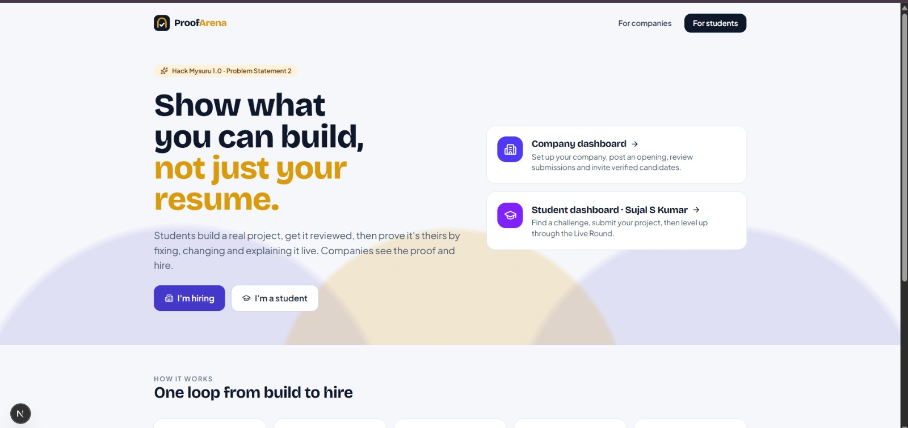
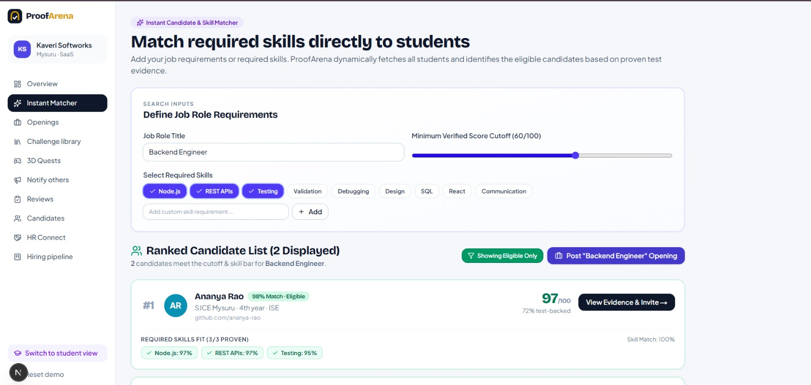
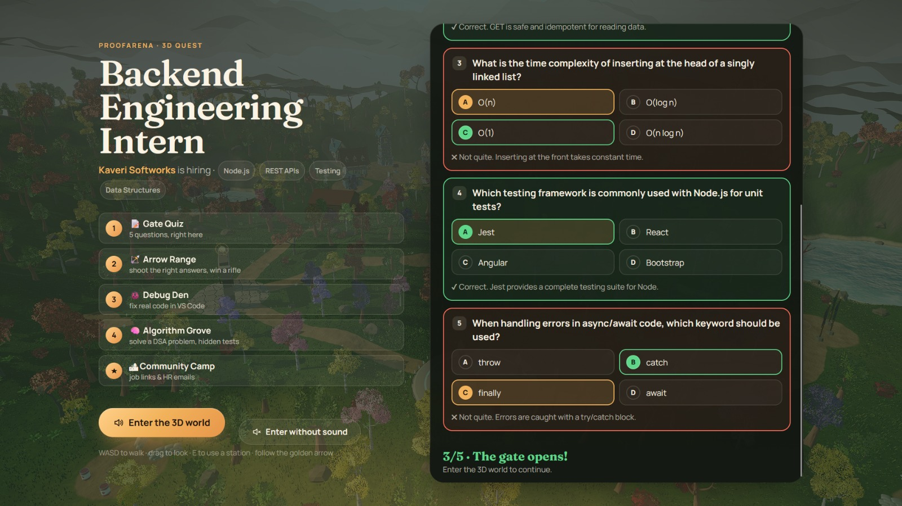
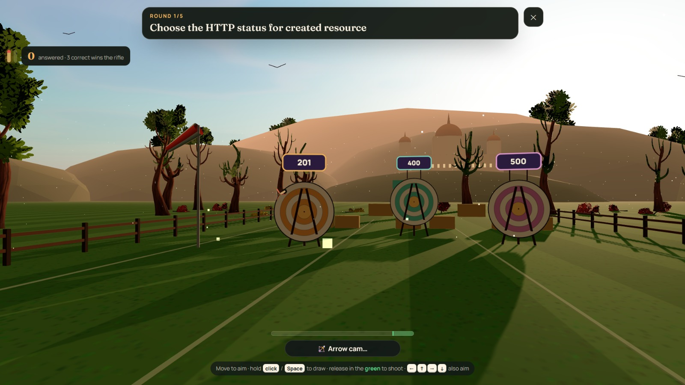
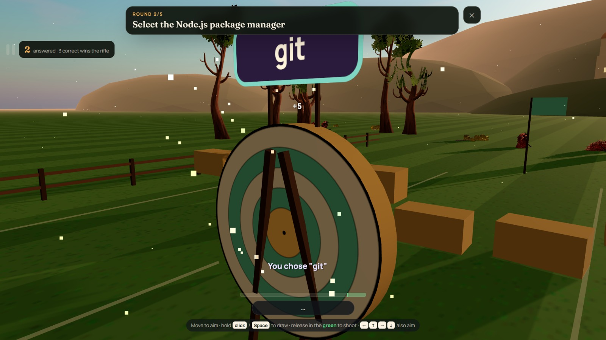
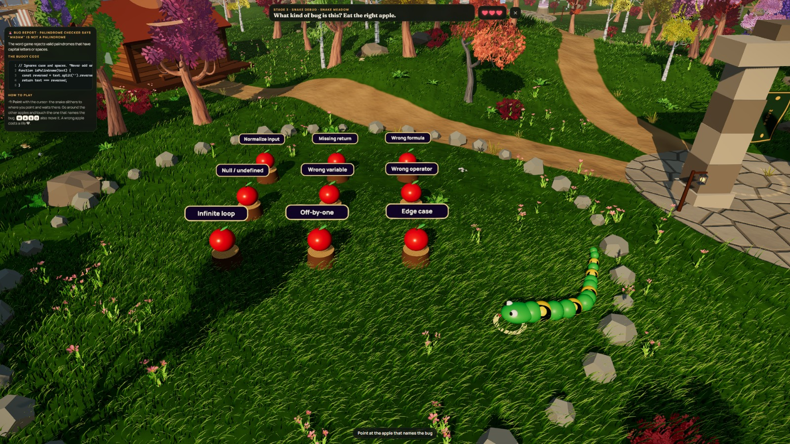
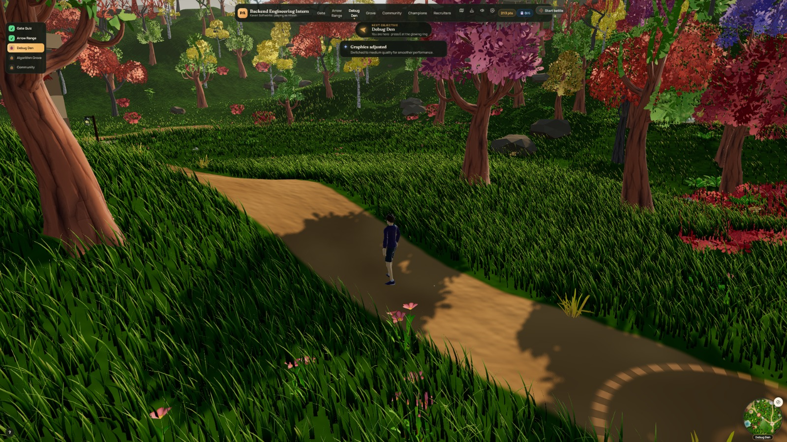
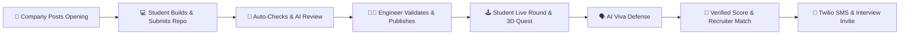

# 🛡️ ProofArena · Hack Mysuru 1.0 (Problem Statement 2).

> **"Show what you can build, not just your resume."**  
> ProofArena is an end-to-end, anti-cheat proof-of-work hiring platform and 3D gamified assessment engine. Students build real-world software, receive AI + human code reviews, and prove original authorship through live in-browser coding challenges, 3D gamified quests, and AI viva defenses.

🚀 **Live Deployed Application**: [https://hack-mysuru.vercel.app/](https://hack-mysuru.vercel.app/)

---

## 📸 Platform & 3D Quest World Screenshots

### 🌐 ProofArena Core Platform & Recruiter Dashboard
| ProofArena Landing Hero | Instant Candidate & Skill Matcher |
| :---: | :---: |
|  |  |
| *Proof-of-work hiring platform hero page* | *Match required job skills directly to verified candidates* |

### 🎮 Interactive 3D Gamified Quest World (Three.js & WebGL)
| 3D Quest Gate Quiz | Arrow Target Range Challenge |
| :---: | :---: |
|  |  |
| *3D campus entrance & gate quiz questions* | *Shoot the correct HTTP status targets to unlock the rifle* |

| Target Hit & Score Cam | Snake Debug Meadow |
| :---: | :---: |
|  |  |
| *Precision arrow trajectory & target hit mechanics* | *Interactive snake debugging station to identify bug types* |

| 3D Open World Campus Exploration |
| :---: |
|  |
| *Explore the 3D campus grounds, interactive stations & portals* |

---

## 🌟 Key Features & Core Innovations

### 1. 🤖 AI + Human Code Review Pipeline
- **Mutation Probing**: Automatically injects subtle bugs into student code to test if student unit test suites catch them.
- **Hidden Edge-Case Testing**: Runs 12+ unannounced automated test suites against student submissions.
- **Groq AI Reviewer**: Generates line-by-line code review feedback and customized viva questions based on exact code diffs.
- **Human Engineer Override**: Company engineers confirm/reject AI findings, grade rubrics, and publish verified scores.

### 2. 🎮 Interactive 3D Quest World (Web-GL Engine)
- Built with **Three.js**, **Vite**, and custom shader materials.
- Includes **5 Gamified Stations**: Gate Quiz (MCQs), Target Range (rifle unlock), Debug Den (in-world code editing), Algorithm Grove (DSA), and Community Camp (direct HR outreach).

### 3. 🎯 Instant Candidate & Skill Matcher
- Recruiters select job roles and required skills (`Node.js`, `REST APIs`, `Testing`, `Validation`, `Debugging`, etc.).
- Algorithm evaluates candidate proof, computing an **Overall Match %**, **Skill Match %**, and **Eligibility Flag**.

### 4. 📱 Dual-Channel Candidate Invite Dispatch (Twilio SMS + Email)
- Recruiters schedule interviews directly from the Kanban pipeline.
- Automatically sends live **Twilio SMS** (`+91 6360577780`) and email notifications with interview dates, times, and recruiter notes.

### 5. 📝 Confidential Recruiter Notes & 1–5 Star Rating
- Internal team collaboration card on candidate proof dossiers allowing recruiters to rate candidates (1–5 stars) and record private notes.

### 6. 📊 Recruiter Analytics & Opening Lifecycle Management
- Real-time funnel metrics: Applications → Awaiting Review → Live Round → Verified → Interview → Offered.
- Lifecycle states for job openings: `Active`, `Paused`, and `Closed`.

---

## 💡 How ProofArena Works (Step-by-Step)



| Step | Persona | Action & Platform Flow |
| :---: | :---: | :--- |
| **1** | **Company** | Picks a pre-built challenge from the library (e.g. *Palace Pass API*). No test writing required. |
| **2** | **Student** | Uses the GitHub template, builds locally, and submits the repo link. |
| **3** | **Platform** | Executes 12 hidden tests, mutation probes, README claim verifications, and drafts AI review comments. |
| **4** | **Engineer** | Reviews AI comments, fills rubric, and publishes. Unlocks the student's **Live Round**. |
| **5** | **Student** | Enters the browser workspace or 3D Quest World. Solves Level 1 Bug Hunt → Level 2 Customer Complaint → Level 3 Boss Twist → Level 4 Viva. |
| **6** | **Company** | Inspects Verified Proof Dossier (timeline replay, test results, diffs, 1–5 star team ratings). |
| **7** | **Recruiter** | Matches skills via Instant Matcher and dispatches **Twilio SMS** + Email interview invites. |

---

## 📐 Scoring & Ranking Algorithm

ProofArena uses a weighted 100-point proof verification system:

$$\text{Total Score (100)} = \text{Phase 1 Review (40)} + \text{Phase 2 Live Round (45)} + \text{Viva Defense (15)}$$

### Recruiter Skill Matching Formula
$$\text{Skill Score} = \text{Direct Skill Subscore} \quad \text{or} \quad \text{Challenge Skill Match}$$
$$\text{Match}_{\text{Skill}} = \left( \frac{\text{Matched Skill Count}}{|S|} \right) \times 100$$
$$\text{Match}_{\text{Overall}} = \min\left(100, \left(0.55 \times \text{Total Score}\right) + \left(0.45 \times \text{Match}_{\text{Skill}}\right)\right)$$

### Mysuru Weekly Leagues (XP System)
- **Sandalwood Tier**: 0 – 399 XP
- **Rosewood Tier**: 400 – 899 XP
- **Silk Tier**: 900 – 1,599 XP
- **Gold Tier**: 1,600 – 2,599 XP
- **Palace Tier**: 2,600+ XP

---

## 📂 Repository Directory Structure

```text
D:\Mysuru_Hackathon\
├── proofarena\                        ← Main Platform (Next.js 16 App Router)
│   ├── app\
│   │   ├── company\                   ← Recruiter Dashboard, Openings, Pipeline & Matcher
│   │   │   ├── candidates\            ← Filterable Candidate List with Star Ratings
│   │   │   ├── matcher\               ← Instant Candidate & Skill Matcher
│   │   │   ├── openings\              ← Opening Lifecycle Management (Active/Paused/Closed)
│   │   │   └── pipeline\              ← Kanban Interview Pipeline & Twilio Invites
│   │   ├── student\                   ← Student Dashboard, Opportunities & In-Browser IDE
│   │   └── api\                       ← REST API Endpoints (Invites, Notes, State, Submissions)
│   ├── components\                    ← Shared UI Components, Dossier Drawer & Notify Bell
│   ├── lib\                           ← Core Logic: Selectors, Review Pipeline, Twilio & AI Engine
│   └── public\quest\                  ← Compiled 3D Quest World Bundle (WebGL)
├── quest-world\                       ← 3D Quest Source Code (Three.js + Vite)
│   └── src\quest\                     ← 3D Stations, Arrow Range, VS Code Panels & Shaders
├── student-project\                   ← Demo Submission ("Palace Pass" API)
├── challenge-template\                ← GitHub Starter Template Repo
└── demo-solutions\                    ← Rehearsal Answers for Live Demonstrations
```

---

## ⚡ Quick Start & Setup Guide

### Prerequisites
- **Node.js**: v20.0.0 or higher
- **Package Manager**: `npm` v10+

### 1. Install & Run Platform
```bash
# Navigate to platform directory
cd src/Mysuru_Hackathon/proofarena

# Install dependencies
npm install

# Start Next.js development server
npm run dev
```
Open **`http://localhost:3000`** (or `http://localhost:3001` if port 3000 is occupied).

### 2. Configure Environment Variables (Optional AI & SMS)
Create or update `src/Mysuru_Hackathon/proofarena/.env.local`:

```env
# Groq AI Key (Free from console.groq.com/keys for AI code review & viva generation)
GROQ_API_KEY=your_groq_api_key_here

# Twilio Credentials (Optional for real-time candidate SMS dispatch)
TWILIO_ACCOUNT_SID=your_account_sid_here
TWILIO_AUTH_TOKEN=your_auth_token_here
TWILIO_FROM=+1xxxxxxxxxx
```

### 3. Build 3D Quest World (Optional - Prebuilt in `/public/quest`)
```bash
cd quest-world
npm install
npm run build
```

---

## 🧪 Rehearsal & Testing Scripts

```bash
# Run automated smoke test (plays full demo flow & resets state)
npm run smoke

# Autoplay specific live round levels for Hitesh:
npm run autoplay -- bug-hunt
npm run autoplay -- fix-review
npm run autoplay -- plot-twist
```

---

## 🔒 Security & Anti-Cheat Guarantees

1. **Clean Workspace Isolation**: Live round tests run on clean ephemeral server copies; candidates cannot bypass tests by editing test files.
2. **Dynamic AI Viva Defense**: Viva questions are dynamically generated from candidate's actual git diffs.
3. **Mutation Probe Verification**: Detects AI-generated code that passes basic tests but lacks test coverage for edge cases.
4. **Prompt Injection Immunity**: AI models only draft candidate feedback; final scoring points are strictly bound to server test execution and human engineer rubrics.

---

## 🏆 Hackathon Details & Credits

- **Hackathon**: Hack Mysuru 1.0 (2026)
- **Problem Statement**: Statement 2 — Proof-of-Work Student Hiring & Skill Verification Platform
- **Team**: POWER RANGERS (Finalist Solution)
- **Primary Tech Stack**: Next.js 16, React 19, TailwindCSS, Three.js, WebGL, Groq AI, Twilio API, Lucide Icons.
